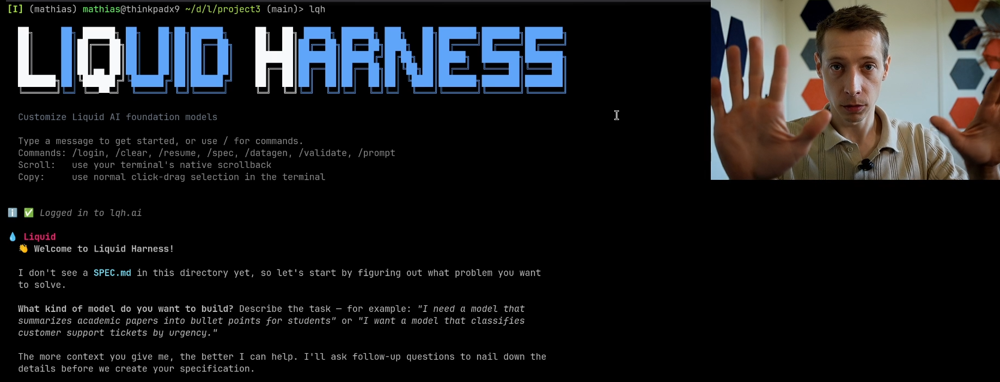

<p align="center">
  <a href="https://youtu.be/suC4VlY8z6Y">
    
  </a>
</p>

# lqh — Liquid Harness

> ⚠️ **Closed beta** — visit [lqh.ai](https://lqh.ai) to request access.

From zero to a fine-tuned LFM in under an hour.

Liquid Harness is a terminal user-interface (TUI) agent for customizing [Liquid Foundation Models](https://www.liquid.ai/). It guide the user to define clear specifications of what problem needs to be solved, writes the data pipeline, scores and filters samples, runs baselines, fine-tunes, and iterates. No ML experience required.

```bash
pip install lqh
lqh
```

## ✨ Features

### 💬 Fully agentic
You chat, the agent works. It interviews you about your task, writes and manages the specifications, then drives every downstream stage end-to-end.

### 📝 Specify in plain English
No DSL, no boilerplate, no ML jargon. Just describe what you want the model to do — the agent captures requirements through dialogue and turns them into structured specs you can refine over time.

### 🧪 Synthetic data, scored & filtered
The agent authors a per-task data generation pipeline, generates samples concurrently on LQH Cloud, and scores each one with an LLM judge against your rubric. The dataset that hits training is already curated.

### 🏋️ Fine-tune locally or in the cloud
Eval and data generation run on LQH Cloud. Training can run locally on your own GPUs, or hand off to a beefier machine — just sync the dataset and continue.

### 🤗 HuggingFace integration
Push and pull datasets from the Hub. Set `HF_TOKEN` to enable private dataset access and dataset publishing.

### 🤖 Hands-off `--auto` mode
Point lqh at a directory and walk away. It either delivers a checkpoint that beats baseline or returns an explicit failure with the reason — never a hang, never a prompt.

### 🖥️ Interactive TUI
Provide input, guide the agent, visualize progress, and inspect dataset samples — all from a single terminal session with a slash-command palette and a live status bar.

### 📦 Project-as-directory
Any directory is a project — fully git-compatible, so you can version, branch, and collaborate on specs, datasets, and runs like any other code. `cd` to switch projects.

## 🚀 The pipeline

One command runs all nine stages. Each is a real component you can inspect, stop at, or hand off.

```
spec → rubric → data gen → filter → baseline → SFT → DPO → eval → checkpoint
```

```
$ lqh --auto ./my-task
[stage: rubric]            writing scorer from spec
[stage: data_gen_draft]    5 samples generated, all valid
[stage: filter_validation] 1,427 / 2,000 kept
[stage: sft_initial]       score 6.8/10  (baseline 4.1)
[stage: dpo]               iter 3/5, score 7.4/10
[final: success]           DPO checkpoint beats baseline by +3.3
```

## 🔧 Requirements

- Python 3.10+
- A Liquid Harness account ([request access](https://lqh.ai))
- Optional: `torch` + `transformers` for local fine-tuning
- Optional: `HF_TOKEN` for HuggingFace dataset sync

## 🔐 Authentication

```
lqh
> /login
```

The CLI stores your token in `~/.lqh/config.json` and authenticates all requests to LQH Cloud.

## 🧬 Base model

Default: **LFM2-1.2B-Instruct** — small, capable, runs anywhere.

## 🗺️ Roadmap / work in progress

Things we're actively building or planning. Open an issue if you want to weigh in.

- **Quantized evals** — run the local evaluation using a quantized model (llama.cpp) so we measure the *exact* artifact that will be deployed (e.g. Q4_0). Includes checkpoint → GGUF conversion as part of the pipeline.
- **Quantization-aware training (QAT)** — once quantized evals are in place, train against the quantization noise so the deployed quantized model matches the full-precision score.
- **Sub-agent spawning** — today there's a single main agent loop. We're adding the ability for the agent to fork or spawn sub-agent processes in parallel for independent subtasks (e.g. drafting multiple data pipelines, running evals concurrently).
- **Training via API or SLURM** — local and direct-SSH training work today. The training backend is already abstracted so SSH+SLURM cluster submission and a hosted training API can drop in, but neither is implemented or end-to-end tested yet.
- **Multi-modal support** — scaffolding for image and audio inputs is in place, but the concrete pipelines, data generators, and end-to-end tests have not been written yet.

## 🤝 Contributing

Please read [CONTRIBUTING.md](./CONTRIBUTING.md) before opening a pull request. **Random PRs will be rejected** — discuss first via an issue, and the discussion will usually conclude with a *prompt* (not a patch) that a coding agent will execute. Security hot fixes are the one exception. See the contribution policy for details.

---

Made with care by [Liquid AI](https://www.liquid.ai/).
